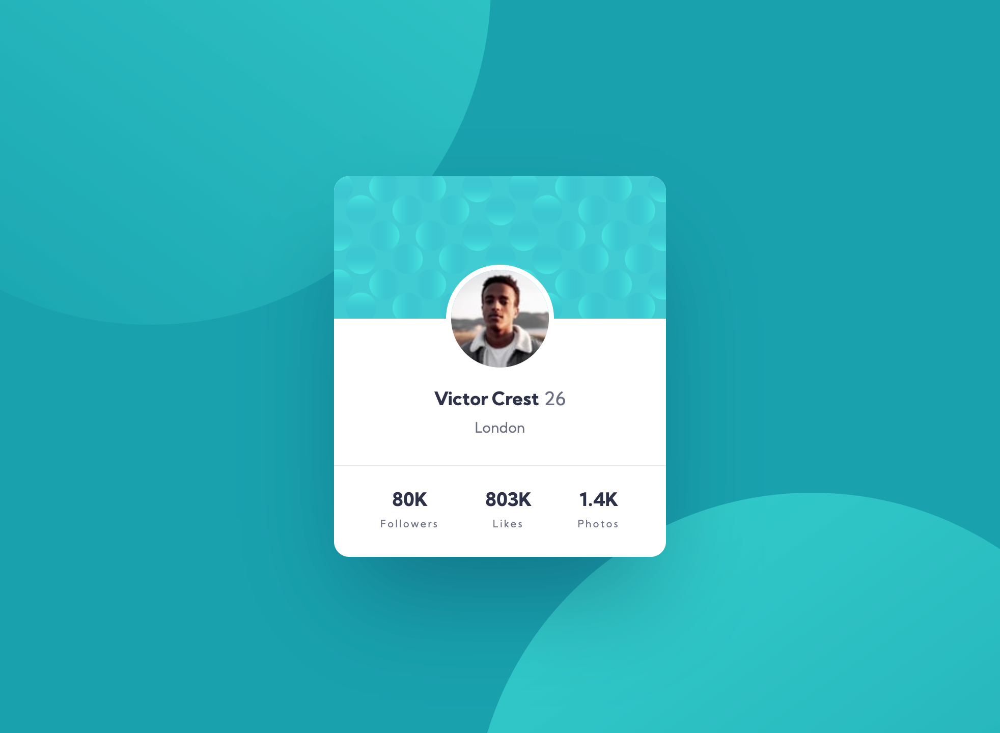
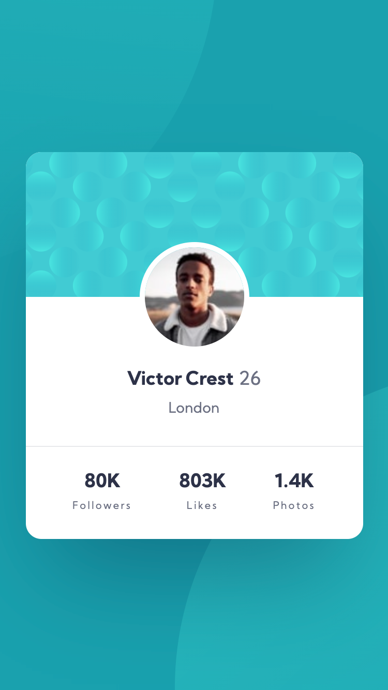

# Frontend Mentor - Profile card component solution

This is a solution to the [Profile card component challenge on Frontend Mentor](https://www.frontendmentor.io/challenges/profile-card-component-cfArpWshJ). Frontend Mentor challenges help you improve your coding skills by building realistic projects.

## Table of contents

- [Frontend Mentor - Profile card component solution](#frontend-mentor---profile-card-component-solution)
  - [Table of contents](#table-of-contents)
  - [Overview](#overview)
    - [The challenge](#the-challenge)
    - [Screenshot](#screenshot)
    - [Links](#links)
  - [My process](#my-process)
    - [Built with](#built-with)
    - [What I learned](#what-i-learned)
  - [Author](#author)

## Overview

### The challenge

Users should be able to:

- View the optimal layout depending on their device's screen size
- See hover states for interactive elements

### Screenshot

### Links

- Solution URL: [Add solution URL here](https://github.com/FocusCookie/fm-meet-landing-page)
- Live Site URL: [Add live site URL here](https://focuscookie.github.io/fm-meet-landing-page/)

## My process

### Built with

- Semantic HTML5 markup
- CSS custom properties
- CSS Background gradients
- ::before & ::after
- Flexbox
- CSS Grid
- Mobile-first workflow

### What I learned

I created the background with a rounded divs where the background was made with the CSS gradients. The two divs where added ::before and ::after the wrapper div.

## Author

- Frontend Mentor - [@FocusCookie](https://www.frontendmentor.io/profile/FocusCookie)
